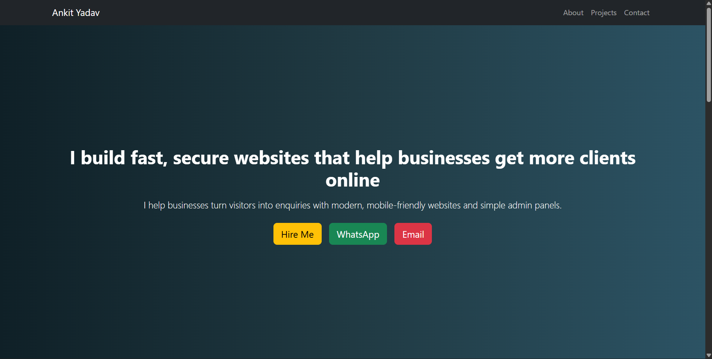
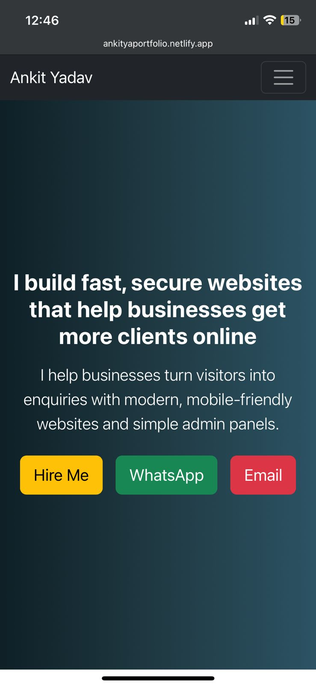

# 🌐 Ankit Yadav – Developer Portfolio

A modern and responsive portfolio website built with HTML, CSS, Bootstrap, and JavaScript to showcase my projects, skills, and frontend development experience.

This portfolio was intentionally designed with a clean and simple UI to ensure better readability, accessibility, and smooth user experience across devices.

---

## ✨ Features

- Responsive modern UI
- Mobile-first design
- Smooth navigation and clean layout
- Project showcase section
- Contact and social media integration
- Optimized frontend performance

---

## 📸 Screenshots

### Desktop View



### Mobile Responsive View



---

## 🛠️ Tech Stack

- HTML5
- CSS3
- Bootstrap 5
- JavaScript

---

## 📦 Installation

```bash
git clone <your-repo-url>
cd portfolio-website
```

Open `index.html` in your browser.

---

## 📤 Deployment

This portfolio is deployed using Netlify and optimized for responsive performance across modern devices and browsers.

---

## 🚧 Ongoing Improvements

This portfolio is continuously being improved with better UI/UX enhancements, performance optimization, and additional frontend features.

Planned improvements include:

- Improved animations and interactions
- More project showcases
- Enhanced accessibility
- Better frontend optimization

---

## 📄 License

This project is open for learning and personal inspiration.
